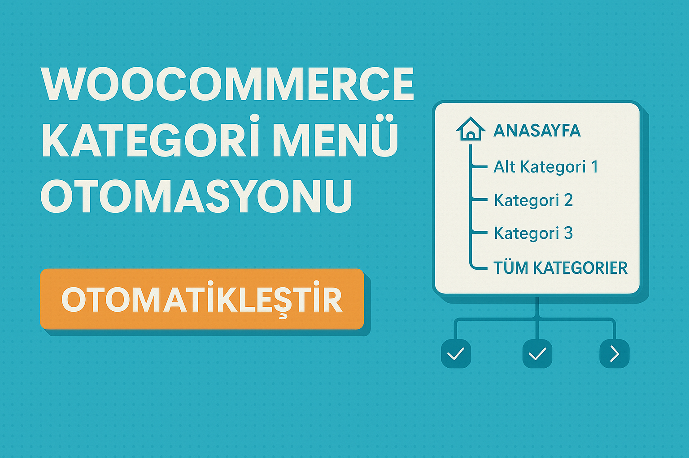

# 🧩 WooCommerce Kategori Menü Yönetimi

**(TR) WordPress sitenizde WooCommerce ürün kategorilerini menüye otomatik ve hiyerarşik olarak eklemenin en kolay yolu.**

---

## 🚀 Özellikler (TR)

- Ürün kategorilerini menüye otomatik ekler (hiyerarşik yapı dahil)
- “Anasayfa” ve “Tüm Kategoriler” bağlantılarını isteğe bağlı ekler
- Kategoriye özel ikon veya CSS sınıfı tanımlayabilirsiniz
- Sadece belirli kategorileri eklemek için seçim paneli
- Var olan menü öğelerini tekrar eklemez (akıllı kontrol)
- Günlük otomatik menü güncellemesi (cron)
- Menü yedekleme (klon) ve temizleme araçları
- SEO uyumlu bağlantı yapısı
- Porto Theme ve Mega Menü uyumu

---

## 🛠️ Gereksinimler

- WordPress 5.5+
- WooCommerce 5.0+
- PHP 7.2+

---

## 🧑‍💻 Geliştirici

**Mertinko**  
[www.mertsenturk.net](https://www.mertsenturk.net)  
📧 İletişim: info@mertsenturk.net

---

## 📜 Lisans

MIT License

---

# 🧩 WooCommerce Category Menu Manager (EN)

**Easiest way to automatically and hierarchically add WooCommerce product categories into your WordPress site's navigation menus.**

---

## 🚀 Features (EN)

- Automatically adds product categories to menu (including nested subcategories)
- Optional “Home” and “All Categories” links
- Icon and CSS class support per category
- Choose categories manually with checkbox panel
- Smart duplicate prevention
- Cron-based daily menu updates
- Menu backup (clone) and cleanup tools
- SEO-friendly structure
- Works with Porto Theme, Mega Menus & more

---

## 🛠️ Requirements

- WordPress 5.5+
- WooCommerce 5.0+
- PHP 7.2+

---

## 🧑‍💻 Developer

**Mertinko**  
[www.mertsenturk.net](https://www.mertsenturk.net)  
📧 Contact: info@mertsenturk.net

---

## 📜 License

MIT License
# 🧩 WooCommerce Kategori Menü Yönetimi

**(TR) WordPress sitenizde WooCommerce ürün kategorilerini menüye otomatik ve hiyerarşik olarak eklemenin en kolay yolu.**

---

## 🚀 Özellikler (TR)

- Ürün kategorilerini menüye otomatik ekler (hiyerarşik yapı dahil)
- “Anasayfa” ve “Tüm Kategoriler” bağlantılarını isteğe bağlı ekler
- Kategoriye özel ikon veya CSS sınıfı tanımlayabilirsiniz
- Sadece belirli kategorileri eklemek için seçim paneli
- Var olan menü öğelerini tekrar eklemez (akıllı kontrol)
- Günlük otomatik menü güncellemesi (cron)
- Menü yedekleme (klon) ve temizleme araçları
- SEO uyumlu bağlantı yapısı
- Porto Theme ve Mega Menü uyumu

---

## 🛠️ Gereksinimler

- WordPress 5.5+
- WooCommerce 5.0+
- PHP 7.2+

---

## 🧑‍💻 Geliştirici

**Mertinko**  
[www.mertsenturk.net](https://www.mertsenturk.net)  
📧 İletişim: info@mertsenturk.net

---

## 📜 Lisans

GPL v2.0 — Açık kaynak ve özgürce kullanılabilir.

---

# 🧩 WooCommerce Category Menu Manager (EN)

**Easiest way to automatically and hierarchically add WooCommerce product categories into your WordPress site's navigation menus.**

---

## 🚀 Features (EN)

- Automatically adds product categories to menu (including nested subcategories)
- Optional “Home” and “All Categories” links
- Icon and CSS class support per category
- Choose categories manually with checkbox panel
- Smart duplicate prevention
- Cron-based daily menu updates
- Menu backup (clone) and cleanup tools
- SEO-friendly structure
- Works with Porto Theme, Mega Menus & more

---

## 🛠️ Requirements

- WordPress 5.5+
- WooCommerce 5.0+
- PHP 7.2+

---

## 🧑‍💻 Developer

**Mertinko**  
[www.mertsenturk.net](https://www.mertsenturk.net)  
📧 Contact: info@mertsenturk.net

---

## 📜 License

GPL v2.0 — Open source and free to use.
